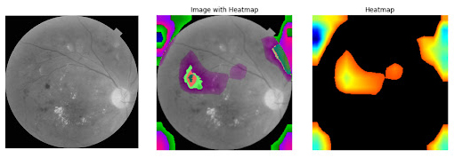
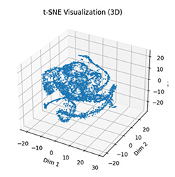

## Portfolio

### AWS | NLP: What If We Search on Airbnb Using Words, instead of a Ton of Filters?

<a href="http://capstone-airbnb.s3-website.us-east-2.amazonaws.com">Website </a>

<a href="https://github.com/tabajara98/airbnb_nlp">GitHub </a>

***Semantic-Search (Searching with Words) on Airbnb***

Instead of selecting area, dates, and checking a bunch of boxes before reading a bunch of reviews to find an idea Airbnb, **what if we could search for the perfec property using a words-based search, like searching on Google?**
This project (L.A. area only for the demo) aims to search using phrases such as 'a waterfront small apartment in XYZ area' or 'a romantic, cozy cabin'.
Built with talented teammates from University of Michigan - Ann Arbor (Ajay Prasad & Antonio Tabajara)

UI/UX: Figma, React

NLP: Hugging Face

Pipelines & Hosting: AWS

  

---

### Clustering | K-Means: Exploring Academic Data and Getting Actionable Insights

<a href="https://github.com/seanlv11/progress/blob/8f8a086d1e8de06ea8e6fd4b1d89b353957eaff2/KMeans_Student_Analysis.ipynb">GitHub </a>

From data to actionable insights. Filling missing values based on domain knowledge. A simple tutorial on k-means clustering using real-world academic data. Are some schools' gauge of student success too heavily dependent on testing scores?

  

---

### NLP | DeBERTa: Actual Disaster or Just Dramatic? (Disaster Tweets)

<a href="https://deepnote.com/workspace/seanlv-e5b5ce69-9533-45e7-8bc1-c6a9fd860161/project/Disaster-Tweets-d54e63a1-6298-432b-a1e4-46213abe9ea2/notebook/nlp-disaster-tweets-with-huggingface-transformers-2-c6e5e4c700aa4a6fafd00e847e01000a">DeepNote </a>

X, formerly Twitter, has become an integral part of breaking news and emergency announcements. Can a model tell the difference between an actual disaster-related tweet 
and a dramatic exclamation a metaphorical apocalypse?

   [-white?logo=X)](#) 

---

### CNN | TensorFlow: Auto Detecting & Classification of Eye Diseases Using AI (Deep Learning)
<a href="https://docs.google.com/document/d/1ZOgKTWLeC8clTZS8VpGSHrENRl19v0Lo-XwTLisXA7o/edit?usp=sharing">Full Report</a> | <a href="https://deepnote.com/workspace/seanlv-e5b5ce69-9533-45e7-8bc1-c6a9fd860161/project/Disaster-Tweets-d54e63a1-6298-432b-a1e4-46213abe9ea2/notebook/6.%20SL%20%E2%80%93%20CNNs%20(Sean)-40fc728a91ec49b5afd22cafdfa05fbf">Deep Note (CNN)</a>

Remote areas of the world are often at disadvantage for preventative, regular healthcare. This is an early stages project using deeplearning aimed to help diagnosis of fundus
diseases as a first line defense for those who do not have easy access to optometrists, as retina scanners can be portable and be carried by volunteers.

###### Image: A heatmap rendering of CNN decision making on a retina scan

###### Image: A t-SNE rendering of non-linear features of retina scans

  

---
[Coming Soon](http://example.com/)

---

Page template forked from <a href="https://github.com/evanca/quick-portfolio">evanca</a>

<!-- Remove above link if you don't want to attibute -->
